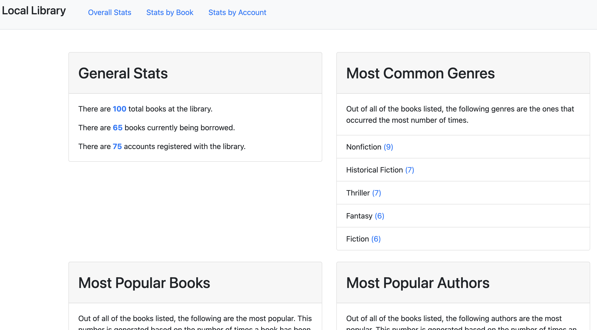

# Library Project

This project is meant to display information for books in a library. The main page will show general information about the total number of books, how many books are currently checked out, and how many accounts there are with the library. In addition, it will also show the most common genres, most popular books, and most popular authors.

## Screenshot

## Technology

### Built with:

- Javascript
- Mocha
- Chai

## Installation

Follow these steps to set up your project locally:

1.  **Clone the repository**

        git clone https://github.com/tpoole1441/library.git

2.  **Navigate to the project directory**

        cd library

3.  **Install dependencies**

        npm install

4.  **Start the development server**

        npm start
